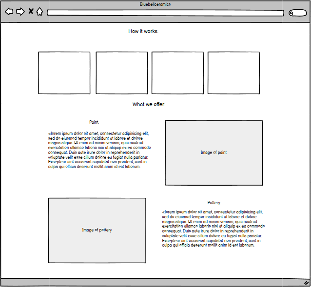
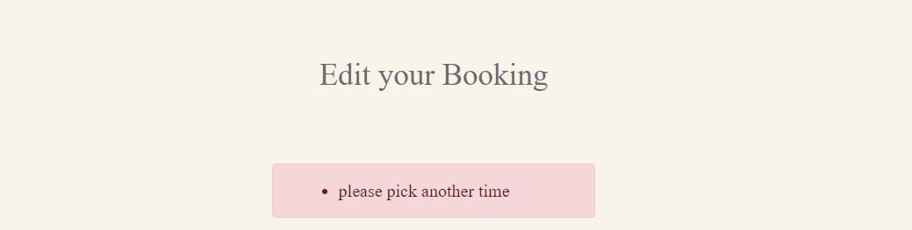
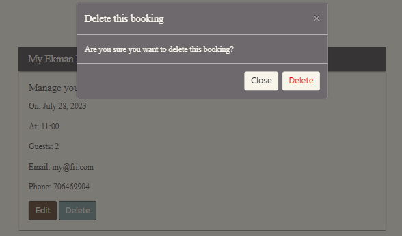

<h1 align="center">Bluebell Ceramics</h1>

## Project goal:
This website is a fictional ceramic studio called Bluebell Ceramics. It is designed to be responsive and accessible on a variety of devices. The main purpose of the site is to attract creativ people to join as members to be able to book sessions. 

[View the live project here.](https://createceramics-1278ee3bf8cf.herokuapp.com/)

- [User Experience (UX)](#user-experience-ux)
  - [User stories](#user-stories)
- [Agile methodology](#agile-methodology)
- [Design](#design)
  - [Wireframes](#wireframes)
- [Features](#fretures)
- [Technologies used](#technologies-used)
- [Programs & Tools](programs-&-tools)
- [Testing](#testing)
  - [Bugs](#bugs)
  - [Manual Testing](#manual-testing)
- [Validation](#validation)
- [Deployment](#deployment)
  -[Forking Repository](#forking)
  -[Making a Clone - 2 ways](#clone)
- [Credits](#credits)

## User Experience (UX):

### User stories

-   ### First Time Visitor Goals

    - As a first time visitor i want to:
    - easily understand the main purpose of the site.
    - easily navigate between pages.
    - be able to register to book a session of pain or turn.
    - be able to log out after creating an account.
      
        
-   ### Returning Visitor Goals
    - As a returning visitor i want to:
    - be able to log in with my created account.
    - be able to make a booking.
    - be able to se my booking in "my bookings".
    - be able to delete or edit my booking.
    - be able to sign out from my account. 

-   ### Frequent User Goals
    -  As a frequent visitor I can login and find my current bookings.
    -  As a frequent visitor I can change or cancel my bookings.

### Agile methodology
To plan this project the github agile tool has been used. By creating user stories to break down the build-up in different stages with tasks for each user story and labels for priority.

and used the github projects page kanbanboard to keep track of what has been accrued and completed.

### Design
The design I was aiming for for this site was a luxurious and clean one, but with a warmth of earthy colors.

Color palette for this project

#### Font  
The fonts for this project: 
 - Body: Cormorant Garamon.
 - Logo: Varela Round.
 - Headings: Angkor.

#### Images  
The pictures are warm and inviting. They must obtain a desire and curiosity to come and create at Bluebell Ceramics.

### Wireframes  

Home page

Book now page

Sign up page

My bookings page

About

## Features

Sign up page

Home page - Larger screens

Home page - Smaller screens

Book now - Larger screens

If not logged in you are asked to register or login to view this page.

Book now- Smaller screens

My Bookings page - Larger Screens

My Bookings page - Smaller Screens

Edit My Bookings page

The alert message is fired in edit your booking if you try to confirm same date and time again. This can be fixed in future features. If you dont want to do any changes to your booking, just press cancel and your booked session will be saved. 

Delete My Bookings page

Features Footer

Success Alert messages

Log out page

### Future features
- Booking confirmation by email.
- Contact form.
- Make a model that makes it possible to leave a recent review.

## Technologies Used

### Languages
- Python
- JavaScript
- HTML5
- CSS3

### Frameworks, Libraries, Programs

Django: python framework used to create all the backend
Database:
PostgreSQL: the database used to store all the data.

### Programs & Tools
- [Google Fonts](https://fonts.google.com/)Was used to to incorporate font styles.
- [Balsamiq](https://balsamiq.com/wireframes/desktop/)Was used to create wireframes.
- [Bootstrap]([Title](https://getbootstrap.com/)), Was used to create the front-end design.
- [Gitpod](https://www.gitpod.io/), Gitpod was used as IDE to commit and push the project to GitHub.
- [Github](https://github.com/), Was used as a version control system to manage the code.
- [Heroku](https://id.heroku.com/login), the hosting service used to host the website.
- [Chroome developer tools](https://developer.chrome.com/docs/devtools/overview/),was used to debug the website.
- [Font Awesome](https://fontawesome.com/)was used to create the icons used on the website.
- [W3C CSS Validator](https://jigsaw.w3.org/css-validator/validator) was used to validate CSS code for the website.
- [W3C Validator](https://validator.w3.org/) was used to validate HTML code fot the website.
- VALIDATOR ADD HERE

## Testing 

### Bugs 
Bug 1: I can change time but not date when i try to edit my bookings.

Bug 1 solution: Change model field to "to date = models.datefield.

Bug 2: Error message not displaying when dubblebooking.

Bug 2 solution: Import validation error. (from django.core.exceptions import ValidationError) and code to model that raises the validation error. 

Bug 3: The footer was floating upp.

Bug 3 solution: Add height of 100vh to main section in every page.

Bug 4: CSS background img not showing on Heroku.

Bug 4 solution: Update the url to the absolute link in cloudinary.

- ### Manual Testing

| Goals/actions  | As a guest | As a logged user  | Result | Comment |
|----------------|:----------:|:-----------------:|:------:|---------|
| I can use navbar and navigating through pages | &check; | &check; | Pass | All 
links navigate me to the right place | &check; |&check;  |  Pass| |
| I can see the book now button in jumbotron | &check; | &check; | Pass | when i clicked it, it navigates me to booknow page and if not logged in it asked me to Login or Register |
| I can see the login page | &check; |&check;  |  Pass| |
| I can see the Sign Up page | &check; |&check;  |  Pass| |
| I can see the register page  | &check; |&check;  |  Pass| |
| I can see the Logout page  | &cross; |&check;  |  Pass| |
| I can see the Booknow page | &cross; | &check;  | Pass | This page and form are available only to logged in members |
| In homepage i can view prices when clicking on button | &check; | &check;  | Pass |This button is viseble for new visitors and logged in members, but only viseble in lg screen and larger |
| I can fill fields in the form the Booknow page | &cross; | &check;  | Pass | As a logged in member i can fill the form and save it with the submit button |
| I can see the my bookings page   | &cross; | &check;  | Pass | This page is available only to loged in members, as a member my bookings is saved in this page |
| I can see the edit booking page  | &cross;  | &check;  | Pass | This page is available only to loged in members, as a logged in member i can edit my bookings and click done to save  |
| I can see the edit booking page and go back  | &cross;  | &check;  | Pass | This page is available only to loged in members, as a logged in member i can go back from edit my booking page to keep my already booked session |
| I can delete booking in the form on the edit booking page  | &cross;  | &check;  | Pass | This page is available only to loged in members, as a logged in member i can click delete button to delete booking |

- #### Device Testing
The website was tested using Google Chrome Developer Dashboard. The following devices have been tested:

Nest HubMax (Desktop)
iPad Pro (Tablet)
iPad Air (Tablet)
iPad Mini (Tablet)
Galaxy Tab S4 (Tablet)
Nexus 7 (Mobile)
Nokia N9 (Mobile)
iPhone 5/SE (Mobile)
iPhone 4 (Mobile)

- #### Browsers Tested
Testing has been carried out on the following browsers:

Google Chrome
Firefox
Microsoft Edge
Safari

## Validation

- ### HTML Validation

- ### CSS Validation 

W3C Validator

## Deployment

The project was developed using Gitpod, the project code is stored on GitHub, and then deployed to Heroku. To deploy, follow these steps:

Log in to Heroku or create an account if you dont have one. When you are loged in you click the button labeled 'New'.

From the drop-down menu select 'Create new app'. Enter your app name. Select your region and Click 'Create App'.

Go to 'Settings' and scroll down to the 'Config Vars' section. Click 'Reveal Config Vars' and enter 'PORT' for the key and '8000' for the value. Then click 'Add'. Add CLOUDINARY_URL, DATABASE_URL and SECRET_KEY. The URL value must be copied from your CLOUDINARY account and the url for your databade_url from your ElephantSQL account. 

Click on the 'Deploy' tab. Next to 'Deployment method' select 'GitHub'. Connect the your GitHub repository. Under 'Manual deploy' click 'Deploy Branch'. Or you can select 'Automatic Deploys' so that the site updates when updates are pushed to GitHub.

After successful deployment message in the page top right corner click the button labeled 'Open app' and you can access live app.

#### Forking Repository
To use this code yourself it is possible to 'fork' the code on the GitHub repository through the following steps:

Create or log into your GitHub account.
Go to the repository you want to fork. 
Click the 'Fork' button in the upper right-hand corner of the page. A copy of the repository will be available in your own repository.

#### Making a Clone - 2 ways
1. Log in to GitHub go to the GitHub Repository you want to clone.
Under the repository name, click button "Code", click "Clone or download".

2. To clone the repository using HTTPS, under "Clone with HTTPS", copy the link.
Open your development editorand open a terminal window.
Type git clone, and then paste the URL you copied in Step 3.
like this: git clone https://github.com/YOUR-USERNAME/YOUR-REPOSITORY

Press Enter.

Your local clone will be created.

## Credits

Code
Bootstrap Documenation was used was used to achieve css styling.
Code Institute walkthroughs "Hello Django" and "I Think Therefore I Blog" was used as inspiration.

Content
All content is written by the author.

Media
The images in this project is taken from [pexles.com](https://www.pexels.com/)

#### Great Resorses
[Django docs](https://docs.djangoproject.com/en/4.2/topics/forms/)
[W3schools](https://www.w3schools.com/tags/tag_script.asp)
[Stack overflow](https://stackoverflow.com/)

Thanks to The tutor support team at Code Institute for their support.
My Code Institute Mentor and the Code Institute Slack community.

